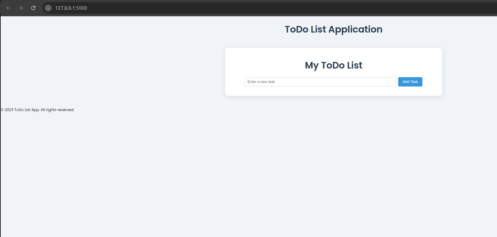

# ToDo List Application

A simple and intuitive ToDo List application built with Flask. This app allows users to manage their tasks by adding, updating, marking as done, and deleting tasks.

## Features

- **Add Tasks**: Add new tasks to your ToDo list.
- **Update Tasks**: Edit the name of existing tasks.
- **Mark as Done**: Mark tasks as completed.
- **Delete Tasks**: Remove tasks from the list.
- **Responsive UI**: A clean and user-friendly interface.

## Prerequisites

Before running the application, ensure you have the following installed:

- Python 3.12 or higher
- Flask
- SQLite (comes pre-installed with Python)

## Installation

1. Clone the repository:
   ```bash
   git clone https://github.com/hiddent3erminal/Todo-List-Flask.git
   cd ToDo-List
   ```

2. Create a virtual environment:
   ```bash
   python3 -m venv env
   source env/bin/activate  # On Windows: env\Scripts\activate
   ```

3. Install dependencies:
   ```bash
   pip install -r requirements.txt
   ```

4. Initialize the database:
   ```bash
   python app.py
   ```
   This will create a `database.db` file if it doesn't already exist.

## Usage

1. Start the Flask development server:
   ```bash
   python app.py
   ```

2. Open your browser and navigate to:
   ```
   http://127.0.0.1:5000/
   ```

3. Use the interface to manage your tasks.

## Project Structure

```
ToDo-List/
├── app.py                 # Main application file
├── database.db            # SQLite database file (auto-created)
├── templates/             # HTML templates
│   ├── base.html          # Base template
│   └── index.html         # Main page template
├── static/                # Static files (CSS, JS, images)
│   └── styles.css         # Stylesheet for the app
├── env/                   # Virtual environment (not included in the repo)
└── README.md              # Project documentation
```

## API Endpoints

- **GET `/`**: Display the list of tasks.
- **POST `/add`**: Add a new task.
- **POST `/update/<task_id>`**: Update an existing task.
- **POST `/done/<task_id>`**: Mark a task as done.
- **POST `/delete/<task_id>`**: Delete a task.

## Screenshots



## Deployment

To deploy the application in a production environment:

1. Install a production-ready server like Gunicorn:
   ```bash
   pip install gunicorn
   ```

2. Run the server:
   ```bash
   gunicorn -w 4 -b 0.0.0.0:8000 app:app
   ```

3. Configure a reverse proxy (e.g., Nginx) for better performance and security.

## Contributing

Contributions are welcome! Feel free to open issues or submit pull requests.

## License

This project is licensed under the MIT License. See the `LICENSE` file for details.

## Acknowledgments

- [Flask Documentation](https://flask.palletsprojects.com/)
- [SQLite Documentation](https://sqlite.org/docs.html)
